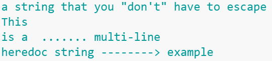

Source: https://www.w3resource.com/python-exercises/python-basic-exercise-13.php

Problem: Write a Python program to print the following 'here document'

Example: 

Sample string: a string that you "don't" have to escape

This

is a ....... multi-line

heredoc string --------> example

