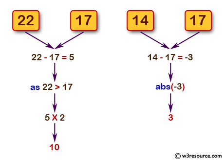

Source: https://www.w3resource.com/python-exercises/python-basic-exercise-16.php

Problem: Write a Python program to get the difference between a given number and 17, if the number is greater than 17 return double the absolute difference.

Example: 

