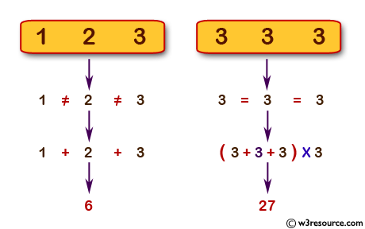

Source: https://www.w3resource.com/python-exercises/python-basic-exercise-18.php

Problem: Write a Python program to calculate the sum of three given numbers, if the values are equal then return thrice of their sum.

Example: 

