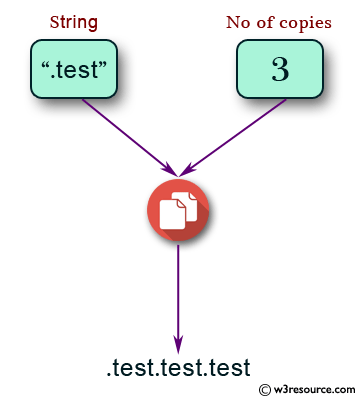

Source: https://www.w3resource.com/python-exercises/python-basic-exercise-20.php

Problem: Write a Python program to get a string which is n (non-negative integer) copies of a given string.

Example: 

